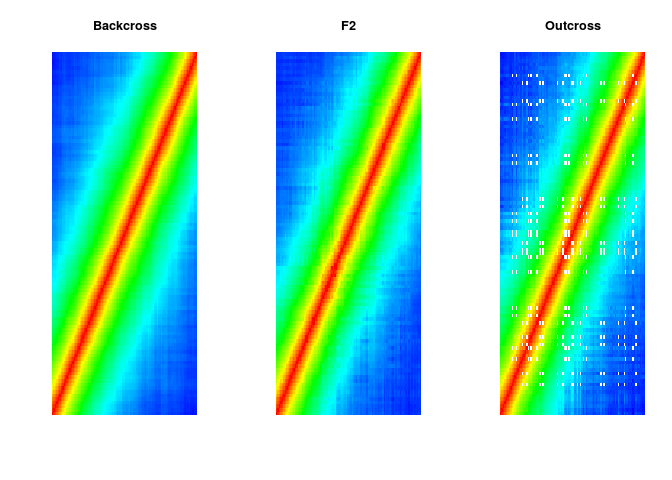
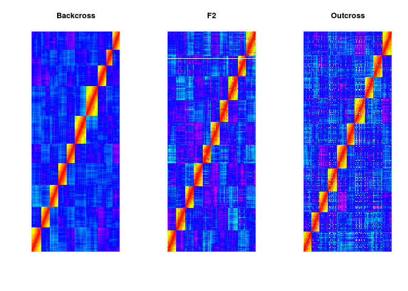
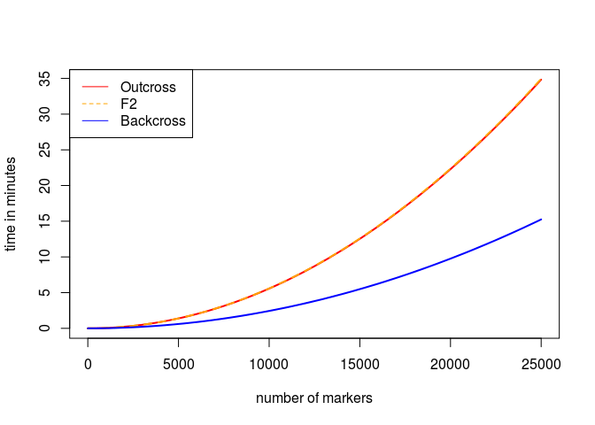

# Report: Two point precedures
Marcelo Mollinari  
October 7, 2015  

This document repots teh advences on the two point proceduers to be implemented into the newer version of OneMap. Since this is my experimental repository, the functions presented here need an extra amount of work to be incorporated into the OneMap package. Also, their are not documented.

First, let us load the **Rcpp** package, some C++ functions:


```r
require(Rcpp)
```

```
## Loading required package: Rcpp
```

```r
require(onemap)
```

```
## Loading required package: onemap
## Loading required package: tcltk
## Loading required package: tkrplot
## Loading required package: ggplot2
```

```r
sourceCpp("cpp/twopt_est_out.cpp")
sourceCpp("cpp/twopt_est_f2.cpp")
sourceCpp("cpp/twopt_est_bc.cpp")
```

Simulating data with thousands of individuals. This allow us to verify if the EM is working properly for all cases:


```r
source("simulate_diploid_populations.R")
n.ind<-5000 # 50000 individuals
n.mrk<-100 # 100 markers
ch.len<-200 # 200 cM chromosome
mis<-10 #10% of missing data

##Backcross
dat.bc<-sim.pop.bc(n.ind = n.ind, n.mrk = n.mrk, ch.len = ch.len, missing = mis, n.ch = 1, verbose = FALSE)
dat.bc
```

```
## This is an object of class 'bc.onemap'
##     No. individuals:     5000 
##     No. markers:         100 
##     Percent genotyped:   90 
## 
##     Number of markers per type:
##        AA : AB --> 100 marker(s)
## 
## This data contains no phenotypic information
```

```r
##F2
dat.f2<-sim.pop.f2(n.ind = n.ind, n.mrk = n.mrk, ch.len = ch.len, dom43 = 20, dom51 =20, missing = mis, n.ch = 1, verbose = FALSE) ## 20 % of dom. markers not B
  dat.f2                                                                                                                             ## 20 % of dom. markers not A
```

```
## This is an object of class 'f2.onemap'
##     No. individuals:     5000 
##     No. markers:         100 
##     Percent genotyped:   90 
## 
##     Number of markers per type:
##        AA : AB : BB -->  60
##         Not BB : BB -->  20
##         Not AA : AA -->  20
## 
## This data contains no phenotypic information
```

```r
##Outcross
dat.out<-sim.pop.out(n.ind = n.ind, n.mrk = n.mrk, ch.len = ch.len, missing = mis, prob = c(1,1,1,1,1,1,1), n.ch = 1, verbose = FALSE) ## equal proportions of types of markers
dat.out                                                                                                                                       ## A: B1:B2:B3:C:D1:D2
```

```
## This is an object of class 'outcross'
##     No. individuals:    5000 
##     No. markers:        100 
##     Segregation types:
##        1:	10
##        2:	14
##        3:	16
##        4:	19
##        5:	14
##        6:	12
##        7:	15
```

Obtaining recombination fractions (under the diagonal) and LOD Scores (above the diagonal). To obtain the recombination fractions and its heatmaps I used just the lower triangle. 


```r
z.bc<-system.time(y.bc<-est_rf_bc(x=dat.bc$geno, n = dat.bc$n.ind))
mat.bc<-as.matrix(as.dist(y.bc, upper = TRUE))
z.f2<-system.time(y.f2<-est_rf_f2(x=dat.f2$geno, type = dat.f2$segr.type.num, n = dat.f2$n.ind))
mat.f2<-as.matrix(as.dist(y.f2, upper = TRUE))
z.out<-system.time(y.out<-est_rf_out(x=dat.out$geno, segreg_type =  dat.out$segr.type.num, n = dat.out$n.ind))
mat.out<-as.matrix(as.dist(y.out[[1]], upper = TRUE))

layout(matrix(1:3, ncol=3))
image(mat.bc, axes=FALSE, col=rainbow(n=500, start=min(mat.bc,na.rm=TRUE)*1.3, end=max(mat.bc,na.rm=TRUE)*1.3), main="Backcross" )
image(mat.f2, axes=FALSE, col=rainbow(n=500, start=min(mat.f2,na.rm=TRUE)*1.3, end=max(mat.f2,na.rm=TRUE)*1.3), main="F2")
image(mat.out, axes=FALSE, col=rainbow(n=500, start=min(mat.out,na.rm=TRUE)*1.3, end=max(mat.out,na.rm=TRUE)*1.3), main="Outcross")
```

 

It is clear that the estimation procedure is OK. The **F2** `heatmap` shown some inconsistences near the diagonal, but they are caused by dominant markers in repulsion phase. I checked with R/qtl and the older version of OneMap and the values are correct. The **Outcross** heatmap shown some empty cells buit they are caused by the combination `D1--D2` markers. 

Now let us simulate datasets with 5.000 of markers, 10 chomosomes and 250 individuals. Norice that I also use the functions `find.bins`and `create.data.bins`, already implemented in the OneMap software, to group markers with reduntant information into bins.


```r
n.ind<-250 # 250 individuals
n.mrk<-5000 # 20000 markers
n.ch<-10
n.mrk.per.ch<-n.mrk/n.ch
ch.len<-200 # 200 cM chromosome
mis<-10 #10% of missing data

##Backcross
dat.bc<-sim.pop.bc(n.ind = n.ind, n.mrk = n.mrk, ch.len = ch.len, missing = mis, n.ch = n.ch, verbose = FALSE)
dat.bc
```

```
## This is an object of class 'bc.onemap'
##     No. individuals:     250 
##     No. markers:         5000 
##     Percent genotyped:   90 
## 
##     Number of markers per type:
##        AA : AB --> 5000 marker(s)
## 
## This data contains no phenotypic information
```

```r
system.time(bins.bc<-find.bins(dat.bc,exact = FALSE))
```

```
##    user  system elapsed 
##   0.309   0.004   0.313
```

```r
bins.bc
```

```
## This is an object of class 'onemap.bin'
##     No. individuals:                         250 
##     No. markers in original dataset:         5000 
##     No. of bins found:                       421 
##     Average of markers per bin:              11.876 
##     Type of search performed:                non exact
```

```r
dat.bc.new<-create.data.bins(dat.bc, bins.bc)
dat.bc.new
```

```
## This is an object of class 'bc.onemap'
##     No. individuals:     250 
##     No. markers:         421 
##     Percent genotyped:   92 
## 
##     Number of markers per type:
##        AA : AB --> 421 marker(s)
## 
## This data contains no phenotypic information
```

```r
##F2
dat.f2<-sim.pop.f2(n.ind = n.ind, n.mrk = n.mrk, ch.len = ch.len, dom43 = 15, dom51 = 15, missing = mis, n.ch = n.ch, verbose = FALSE)
dat.f2
```

```
## This is an object of class 'f2.onemap'
##     No. individuals:     250 
##     No. markers:         5000 
##     Percent genotyped:   90 
## 
##     Number of markers per type:
##        AA : AB : BB -->  3500
##         Not BB : BB -->  750
##         Not AA : AA -->  750
## 
## This data contains no phenotypic information
```

```r
system.time(bins.f2<-find.bins(dat.f2,exact = FALSE))
```

```
##    user  system elapsed 
##   1.652   0.002   1.654
```

```r
bins.f2
```

```
## This is an object of class 'onemap.bin'
##     No. individuals:                         250 
##     No. markers in original dataset:         5000 
##     No. of bins found:                       1289 
##     Average of markers per bin:              3.879 
##     Type of search performed:                non exact
```

```r
dat.f2.new<-create.data.bins(dat.f2, bins.f2)
dat.f2.new
```

```
## This is an object of class 'f2.onemap'
##     No. individuals:     250 
##     No. markers:         1289 
##     Percent genotyped:   91 
## 
##     Number of markers per type:
##        AA : AB : BB -->  733
##         Not BB : BB -->  275
##         Not AA : AA -->  281
## 
## This data contains no phenotypic information
```

```r
##Outcross
dat.out<-sim.pop.out(n.ind = n.ind, n.mrk = n.mrk, ch.len = ch.len, missing = mis, prob=c(1,1,1,1,1,1,1), n.ch = n.ch, verbose = FALSE) 
dat.out
```

```
## This is an object of class 'outcross'
##     No. individuals:    250 
##     No. markers:        5000 
##     Segregation types:
##        1:	703
##        2:	725
##        3:	700
##        4:	697
##        5:	743
##        6:	732
##        7:	700
```

```r
system.time(bins.out<-find.bins(dat.out,exact = FALSE))
```

```
##    user  system elapsed 
##   5.154   0.000   5.158
```

```r
bins.out
```

```
## This is an object of class 'onemap.bin'
##     No. individuals:                         250 
##     No. markers in original dataset:         5000 
##     No. of bins found:                       2353 
##     Average of markers per bin:              2.1249 
##     Type of search performed:                non exact
```

```r
dat.out.new<-create.data.bins(dat.out, bins.out)
dat.out.new
```

```
## This is an object of class 'outcross'
##     No. individuals:    250 
##     No. markers:        2353 
##     Segregation types:
##        1:	399
##        2:	364
##        3:	348
##        4:	412
##        5:	290
##        6:	283
##        7:	257
```

Estimating the recombination fraction between 5.000 markers for each population 


```r
##Backcross
dat.bc.new$n.mar ##Number of markers
```

```
## [1] 421
```

```r
(z.bc<-system.time(y.bc<-est_rf_bc(x=dat.bc.new$geno, n = dat.bc$n.ind)))
```

```
##    user  system elapsed 
##   0.252   0.006   0.259
```

```r
mat.bc<-as.matrix(as.dist(y.bc, upper = TRUE))
##F2
dat.bc.new$n.mar ##Number of markers
```

```
## [1] 421
```

```r
(z.f2<-system.time(y.f2<-est_rf_f2(x=dat.f2.new$geno, type = dat.f2.new$segr.type.num, n = dat.f2$n.ind)))
```

```
##    user  system elapsed 
##   5.557   0.015   5.571
```

```r
mat.f2<-as.matrix(as.dist(y.f2, upper = TRUE))
##Outcross
dat.out.new$n.mar ##Number of markers
```

```
## [1] 2353
```

```r
(z.out<-system.time(y.out<-est_rf_out(x=dat.out.new$geno, segreg_type =  dat.out.new$segr.type.num, n = dat.out$n.ind)))
```

```
##    user  system elapsed 
##  18.460   0.036  18.507
```

```r
mat.out<-as.matrix(as.dist(y.out[[1]], upper = TRUE))

layout(matrix(1:3, ncol=3))
image(mat.bc, axes=FALSE, col=rainbow(n=500, start=min(mat.bc,na.rm=TRUE)*1.3, end=max(mat.bc,na.rm=TRUE)*1.3), main="Backcross" )
image(mat.f2, axes=FALSE, col=rainbow(n=500, start=min(mat.f2,na.rm=TRUE)*1.3, end=max(mat.f2,na.rm=TRUE)*1.3), main="F2")
image(mat.out, axes=FALSE, col=rainbow(n=500, start=min(mat.out,na.rm=TRUE)*1.3, end=max(mat.out,na.rm=TRUE)*1.3), main="Outcross")
```

 

Evaluating the performace of the two-point procedures


```r
speed.bc<-function(w) choose(w,2) * z.bc[3]/(60*choose(dat.bc.new$n.mar,2))
speed.f2<-function(w) choose(w,2) * z.f2[3]/(60*choose(dat.f2.new$n.mar,2))
speed.out<-function(w) choose(w,2) * z.out[3]/(60*choose(dat.out.new$n.mar,2))

curve(speed.out, 1, 25000, col="red", lwd=2, xlab = "number of markers", ylab = "time in minutes")
curve(speed.f2, 1, 25000, col="orange", lwd=2, lty=2, add=TRUE)
curve(speed.bc, 1, 25000, col="blue", lwd=2, add=TRUE)

legend("topleft", legend = c("Outcross","F2",  "Backcross"),
       lty = c(1,2,1), xjust = 1, yjust = 1,
        col=c("red", "orange", "blue"))
```

 

