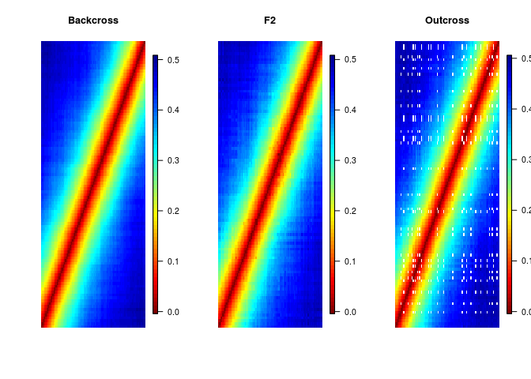
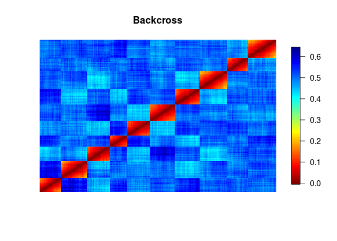
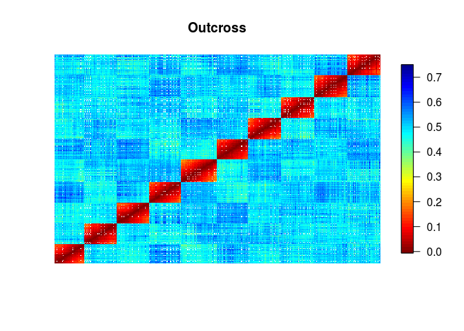
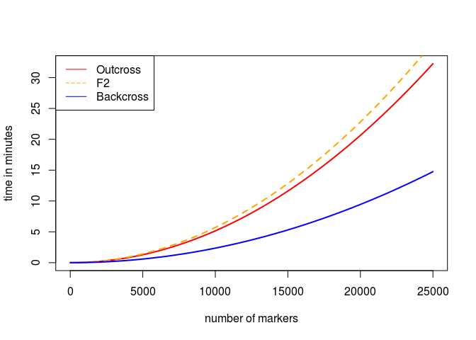
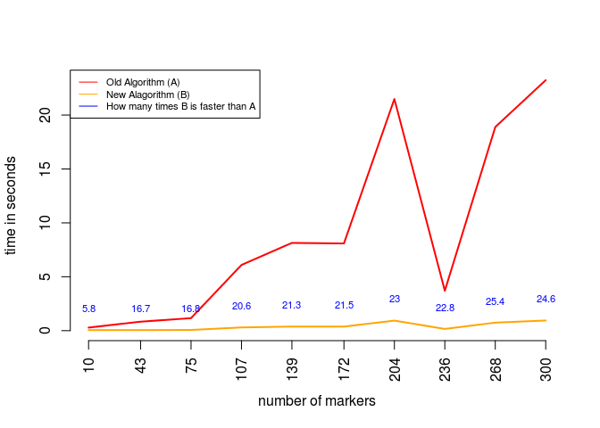

# Report: Two point precedures
Marcelo Mollinari  
October 7, 2015  

This document reports the advances on the two point procedures to be implemented into the newer version of OneMap. Since this is my experimental repository, the functions presented here need an extra amount of work to be incorporated into the OneMap package. Also, their are not documented.

First, let us load the **Rcpp** package, some C++ functions:


```r
require(Rcpp)
```

```
## Loading required package: Rcpp
```

```r
require(onemap)
```

```
## Loading required package: onemap
## Loading required package: tcltk
## Loading required package: tkrplot
## Loading required package: ggplot2
```

```r
sourceCpp("cpp/twopt_est_out.cpp")
sourceCpp("cpp/twopt_est_f2.cpp")
sourceCpp("cpp/twopt_est_bc.cpp")
```

Simulating data with thousands of individuals. This allow us to verify if the EM is working properly for all cases:


```r
source("simulate_diploid_populations.R")
n.ind<-5000 # 50000 individuals
n.mrk<-100 # 100 markers
ch.len<-200 # 200 cM chromosome
mis<-10 #10% of missing data

##Backcross
dat.bc<-sim.pop.bc(n.ind = n.ind, n.mrk = n.mrk, ch.len = ch.len, missing = mis, n.ch = 1, verbose = FALSE)
dat.bc
```

```
## This is an object of class 'bc.onemap'
##     No. individuals:     5000 
##     No. markers:         100 
##     Percent genotyped:   90 
## 
##     Number of markers per type:
##        AA : AB --> 100 marker(s)
## 
## This data contains no phenotypic information
```

```r
##F2
dat.f2<-sim.pop.f2(n.ind = n.ind, n.mrk = n.mrk, ch.len = ch.len, dom43 = 20, dom51 =20, missing = mis, n.ch = 1, verbose = FALSE) ## 20 % of dom. markers not B
  dat.f2                                                                                                                             ## 20 % of dom. markers not A
```

```
## This is an object of class 'f2.onemap'
##     No. individuals:     5000 
##     No. markers:         100 
##     Percent genotyped:   90 
## 
##     Number of markers per type:
##        AA : AB : BB -->  60
##         Not BB : BB -->  20
##         Not AA : AA -->  20
## 
## This data contains no phenotypic information
```

```r
##Outcross
dat.out<-sim.pop.out(n.ind = n.ind, n.mrk = n.mrk, ch.len = ch.len, missing = mis, prob = c(1,1,1,1,1,1,1), n.ch = 1, verbose = FALSE) ## equal proportions of types of markers
dat.out                                                                                                                                       ## A: B1:B2:B3:C:D1:D2
```

```
##   This is an object of class 'outcross'
##     No. individuals:    5000 
##     No. markers:        100 
##     Segregation types:
##        1:	22
##        2:	11
##        3:	14
##        4:	15
##        5:	9
##        6:	14
##        7:	15
##     No. traits:         0
```

Obtaining recombination fractions (under the diagonal) and LOD Scores (above the diagonal). To obtain the recombination fractions and its heat maps I used just the lower triangle. 


```r
z.bc<-system.time(y.bc<-est_rf_bc(x=dat.bc$geno, n = dat.bc$n.ind))
mat.bc<-as.matrix(as.dist(y.bc, upper = TRUE))
z.f2<-system.time(y.f2<-est_rf_f2(x=dat.f2$geno, type = dat.f2$segr.type.num, n = dat.f2$n.ind))
mat.f2<-as.matrix(as.dist(y.f2, upper = TRUE))
z.out<-system.time(y.out<-est_rf_out(x=dat.out$geno, segreg_type =  dat.out$segr.type.num, n = dat.out$n.ind))
mat.out<-as.matrix(as.dist(y.out[[1]], upper = TRUE))

require(fields)
```

```
## Loading required package: fields
## Loading required package: spam
## Loading required package: grid
## Spam version 1.2-1 (2015-09-30) is loaded.
## Type 'help( Spam)' or 'demo( spam)' for a short introduction 
## and overview of this package.
## Help for individual functions is also obtained by adding the
## suffix '.spam' to the function name, e.g. 'help( chol.spam)'.
## 
## Attaching package: 'spam'
## 
## The following objects are masked from 'package:base':
## 
##     backsolve, forwardsolve
## 
## Loading required package: maps
## 
##  # ATTENTION: maps v3.0 has an updated 'world' map.        #
##  # Many country borders and names have changed since 1990. #
##  # Type '?world' or 'news(package="maps")'. See README_v3. #
## 
## 
## 
## Attaching package: 'maps'
## 
## The following object is masked from 'package:onemap':
## 
##     map
```

```r
layout(matrix(1:3, ncol=3))
image.plot(mat.bc, axes=FALSE, col = rev(tim.colors()), main="Backcross" )
image.plot(mat.f2, axes=FALSE, col = rev(tim.colors()), main="F2")
image.plot(mat.out, axes=FALSE, col =  rev(tim.colors()), main="Outcross")
```

 

It is clear that the estimation procedure is OK. The **F2** `heatmap` shows some inconsistencies near the diagonal, but they are caused by dominant markers in repulsion phase. I checked with R/qtl and the older version of OneMap and the values are correct. In the **Outcross** heatmap it is possible to see some empty cells. In this case, they are caused by the combination `D1--D2` markers. 

Now let us simulate datasets with 5.000 of markers, 10 chromosomes and 250 individuals. Notice that I also use the functions `find.bins`and `create.data.bins`, already implemented in the OneMap software, to group markers with redundant information into bins.


```r
n.ind<-250 # 250 individuals
n.mrk<-5000 # 5000 markers
n.ch<-10
n.mrk.per.ch<-n.mrk/n.ch
ch.len<-200 # 200 cM chromosome
mis<-10 #10% of missing data

##Backcross
dat.bc<-sim.pop.bc(n.ind = n.ind, n.mrk = n.mrk, ch.len = ch.len, missing = mis, n.ch = n.ch, verbose = FALSE)
dat.bc
```

```
## This is an object of class 'bc.onemap'
##     No. individuals:     250 
##     No. markers:         5000 
##     Percent genotyped:   90 
## 
##     Number of markers per type:
##        AA : AB --> 5000 marker(s)
## 
## This data contains no phenotypic information
```

```r
system.time(bins.bc<-find.bins(dat.bc,exact = FALSE))
```

```
##    user  system elapsed 
##   0.319   0.000   0.317
```

```r
bins.bc
```

```
## This is an object of class 'onemap.bin'
##     No. individuals:                         250 
##     No. markers in original dataset:         5000 
##     No. of bins found:                       466 
##     Average of markers per bin:              10.72961 
##     Type of search performed:                non exact
```

```r
dat.bc.new<-create.data.bins(dat.bc, bins.bc)
dat.bc.new
```

```
## This is an object of class 'bc.onemap'
##     No. individuals:     250 
##     No. markers:         466 
##     Percent genotyped:   92 
## 
##     Number of markers per type:
##        AA : AB --> 466 marker(s)
## 
## This data contains no phenotypic information
```

```r
##F2
dat.f2<-sim.pop.f2(n.ind = n.ind, n.mrk = n.mrk, ch.len = ch.len, dom43 = 30, dom51 = 30, missing = mis, n.ch = n.ch, verbose = FALSE)
dat.f2
```

```
## This is an object of class 'f2.onemap'
##     No. individuals:     250 
##     No. markers:         5000 
##     Percent genotyped:   90 
## 
##     Number of markers per type:
##        AA : AB : BB -->  2000
##         Not BB : BB -->  1500
##         Not AA : AA -->  1500
## 
## This data contains no phenotypic information
```

```r
system.time(bins.f2<-find.bins(dat.f2,exact = FALSE))
```

```
##    user  system elapsed 
##   1.581   0.015   1.595
```

```r
bins.f2
```

```
## This is an object of class 'onemap.bin'
##     No. individuals:                         250 
##     No. markers in original dataset:         5000 
##     No. of bins found:                       1319 
##     Average of markers per bin:              3.790751 
##     Type of search performed:                non exact
```

```r
dat.f2.new<-create.data.bins(dat.f2, bins.f2)
dat.f2.new
```

```
## This is an object of class 'f2.onemap'
##     No. individuals:     250 
##     No. markers:         1319 
##     Percent genotyped:   91 
## 
##     Number of markers per type:
##        AA : AB : BB -->  635
##         Not BB : BB -->  332
##         Not AA : AA -->  352
## 
## This data contains no phenotypic information
```

```r
##Outcross
dat.out<-sim.pop.out(n.ind = n.ind, n.mrk = n.mrk, ch.len = ch.len, missing = mis, prob=c(1,1,1,1,1,1,1), n.ch = n.ch, verbose = FALSE) 
dat.out
```

```
##   This is an object of class 'outcross'
##     No. individuals:    250 
##     No. markers:        5000 
##     Segregation types:
##        1:	741
##        2:	704
##        3:	735
##        4:	743
##        5:	682
##        6:	712
##        7:	683
##     No. traits:         0
```

```r
system.time(bins.out<-find.bins(dat.out,exact = FALSE))
```

```
##    user  system elapsed 
##   4.794   0.000   4.794
```

```r
bins.out
```

```
## This is an object of class 'onemap.bin'
##     No. individuals:                         250 
##     No. markers in original dataset:         5000 
##     No. of bins found:                       2365 
##     Average of markers per bin:              2.114165 
##     Type of search performed:                non exact
```

```r
dat.out.new<-create.data.bins(dat.out, bins.out)
dat.out.new
```

```
##   This is an object of class 'outcross'
##     No. individuals:    250 
##     No. markers:        2365 
##     Segregation types:
##        1:	411
##        2:	337
##        3:	366
##        4:	414
##        5:	272
##        6:	281
##        7:	284
##     No. traits:         0
```

Estimating the recombination fraction between all markers for each population 


```r
##Backcross
dat.bc.new$n.mar ##Number of markers
```

```
## [1] 466
```

```r
(z.bc<-system.time(y.bc<-est_rf_bc(x=dat.bc.new$geno, n = dat.bc$n.ind)))
```

```
##    user  system elapsed 
##   0.304   0.004   0.307
```

```r
mat.bc<-as.matrix(as.dist(y.bc, upper = TRUE))
##F2
dat.f2.new$n.mar ##Number of markers
```

```
## [1] 1319
```

```r
(z.f2<-system.time(y.f2<-est_rf_f2(x=dat.f2.new$geno, type = dat.f2.new$segr.type.num, n = dat.f2$n.ind)))
```

```
##    user  system elapsed 
##   5.930   0.027   5.953
```

```r
mat.f2<-as.matrix(as.dist(y.f2, upper = TRUE))
##Outcross
dat.out.new$n.mar ##Number of markers
```

```
## [1] 2365
```

```r
(z.out<-system.time(y.out<-est_rf_out(x=dat.out.new$geno, segreg_type =  dat.out.new$segr.type.num, n = dat.out$n.ind)))
```

```
##    user  system elapsed 
##  17.231   0.088  17.315
```

```r
mat.out<-as.matrix(as.dist(y.out[[1]], upper = TRUE))
```

   

Evaluating the performance of the two-point procedures


```r
speed.bc<-function(w) choose(w,2) * z.bc[3]/(60*choose(dat.bc.new$n.mar,2))
speed.f2<-function(w) choose(w,2) * z.f2[3]/(60*choose(dat.f2.new$n.mar,2))
speed.out<-function(w) choose(w,2) * z.out[3]/(60*choose(dat.out.new$n.mar,2))

curve(speed.out, 1, 25000, col="red", lwd=2, xlab = "number of markers", ylab = "time in minutes")
curve(speed.f2, 1, 25000, col="orange", lwd=2, lty=2, add=TRUE)
curve(speed.bc, 1, 25000, col="blue", lwd=2, add=TRUE)

legend("topleft", legend = c("Outcross","F2",  "Backcross"),
       lty = c(1,2,1), xjust = 1, yjust = 1,
        col=c("red", "orange", "blue"))
```

 

Notice that, in this case, the f2 procedure is less efficient than the outcross. This is caused by the dominant markers in repulsion present in the data. Since the simulation was performed with 60% of dominant markers, several them are in repulsion. In the outcross simulations, this type of configuration happens in a small proportion of the data (markers C in repulsion). This configuration is known as the worst case to estimate (low power) and the EM takes several iterations to converge.

##Next steps

1. Implement these codes in OneMap.
2. Try to use some level of parallelizarion
3. Adjust the codes and the objects (create classes, methods, etc) and see if works fine with the previous version of OneMap

##Fast HMM codes


```r
require(onemap)
require(Rcpp)
source("simulate_diploid_populations.R")
n.ind<-250 # 250 individuals
n.mrk<-100 # 5000 markers
n.ch<-1
n.mrk.per.ch<-n.mrk/n.ch
ch.len<-200 # 200 cM chromosome
mis<-0 #10% of missing data
dat.f2<-sim.pop.f2(n.ind = n.ind, n.mrk = n.mrk, ch.len = ch.len, dom43 = 1, dom51 = 1, missing = mis, n.ch = n.ch, verbose = FALSE)

sourceCpp("misc/hmm_f2_old.cpp")
sourceCpp("cpp/hmm_f2.cpp")


  geno<-t(dat.f2$geno)
  dim(geno)
```

```
## [1] 100 250
```

```r
system.time(z<-est_hmm_f2_old(Geno = geno, rf = rep(0.1, 99), 1)) 
```

```
##    user  system elapsed 
##   5.077   0.062   5.123
```

```r
system.time(z<-est_hmm_f2(Geno = geno, rf = rep(0.1, 99), 1)) 
```

```
##    user  system elapsed 
##   0.232   0.049   0.264
```

```r
m<-ceiling(seq(10,300, length.out = 10))
tm.old<-tm.new<-NULL

for(i in m)
{
  print(i)
  dat.f2<-sim.pop.f2(n.ind = n.ind, n.mrk = i, ch.len = ch.len, dom43 = 1, dom51 = 0, missing = mis, n.ch = n.ch, verbose = FALSE)
  geno<-t(dat.f2$geno)
  tm.old<-c(tm.old, system.time(z<-est_hmm_f2_old(Geno = geno, rf = rep(0.1, (i-1)), 1))[3]) 
  tm.new<-c(tm.new, system.time(z1<-est_hmm_f2(Geno = geno, rf = rep(0.1, (i-1)), 1))[3])
}
```

```
## [1] 10
## [1] 43
## [1] 75
## [1] 107
## [1] 139
## [1] 172
## [1] 204
## [1] 236
## [1] 268
## [1] 300
```

Hidden Markov model performance


```r
plot(x=m, y=tm.old, type="l", col=2, lwd=2, ylim=c(0,max(tm.old)),  xlab = "number of markers", ylab = "time in seconds", axes=FALSE)
lines(x=m, y=tm.new, type="l", col="orange", lwd=2)
axis(1, at=m, las=2)
axis(2)
text(x = m, y = tm.new+2, labels = round(tm.old/tm.new,1), cex=.7, col="blue")
legend("topleft", legend = c("Old Algorithm (A)","New Alagorithm (B)", "How many times B is faster than A"),
       lty = c(1,1), xjust = 1, yjust = 1,
        col=c("red", "orange", "blue"), cex=.7)
```

 
